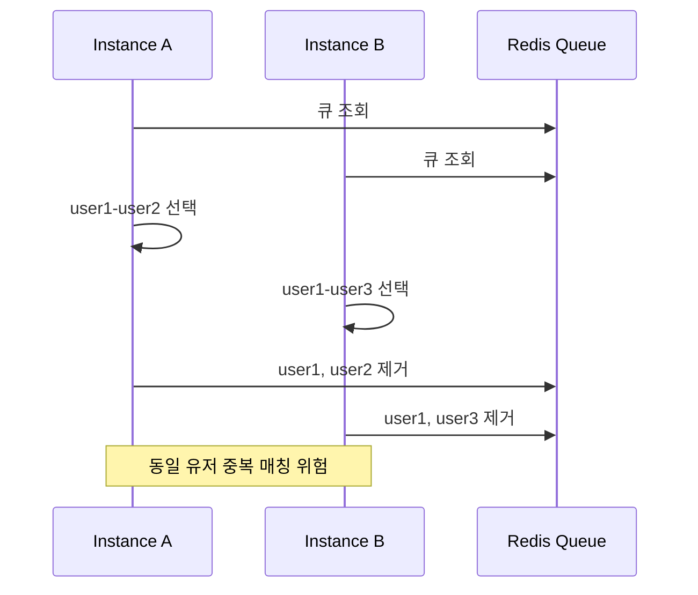
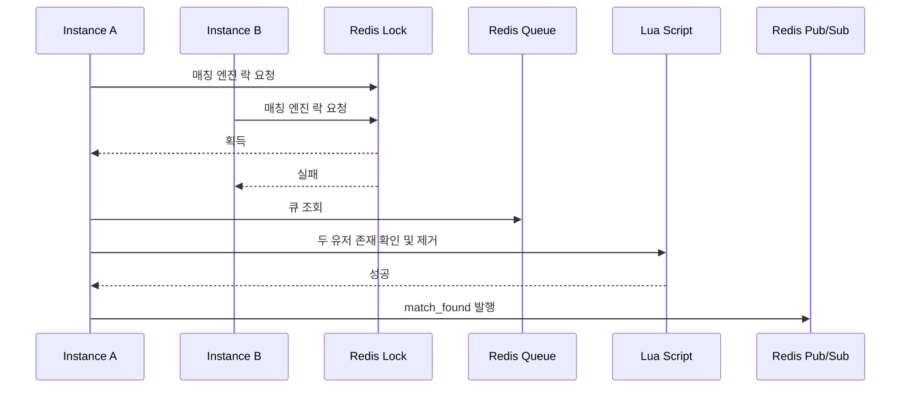
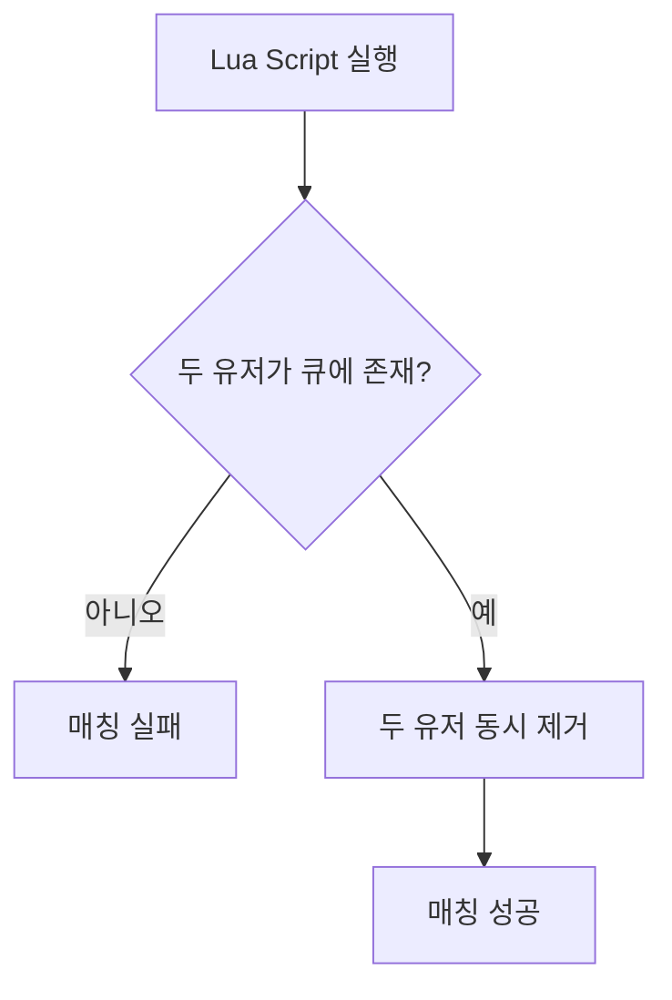
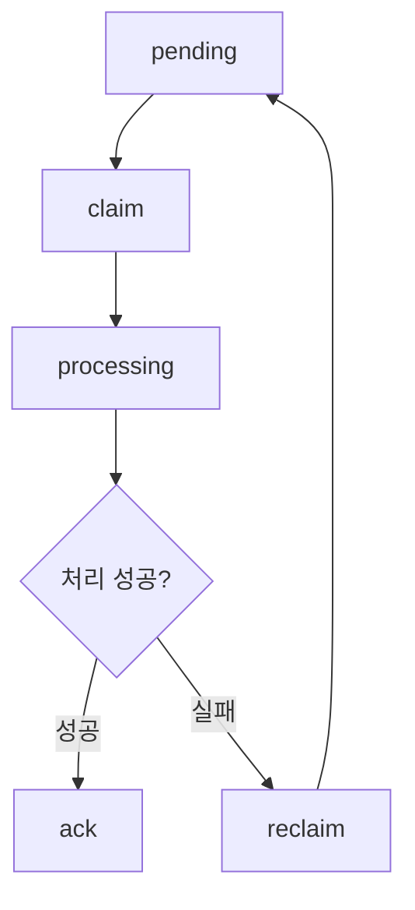
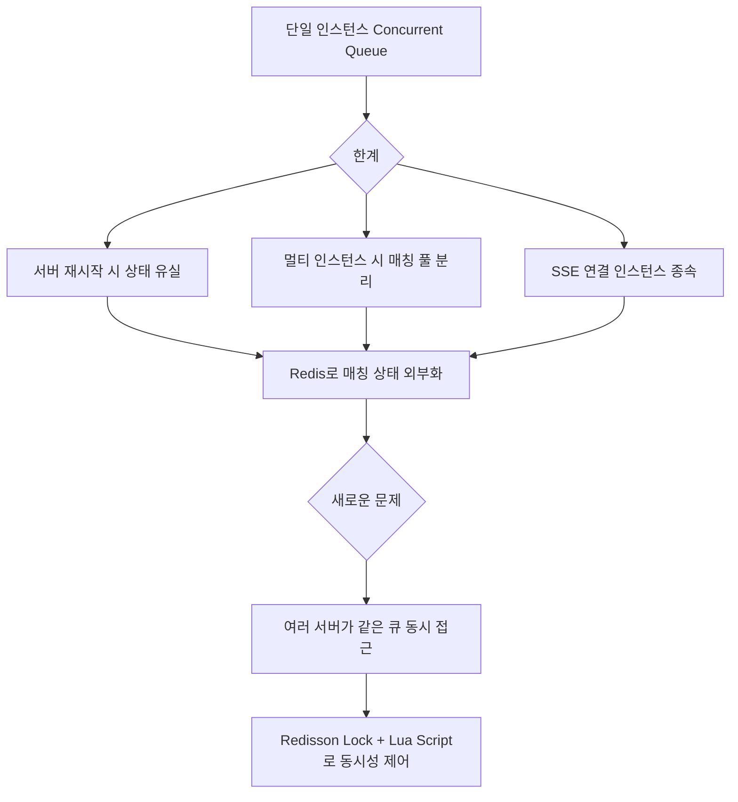

# 멀티 인스턴스 환경에서 Redis 기반 매칭 동시성 제어

## 개선 전 흐름

## 개선 후 흐름

## 문제 원인

단일 인스턴스 전제 : 초기 매칭 구조에서는 하나의 서버 인스턴스에서 매칭 스케줄러가 동작하는 상황을 전제로 했다. 하지만 API 서버를 2개 이상으로 확장하면 각 인스턴스의 스케줄러가 동시에 Redis 매칭 큐를 스캔할 수 있었다.

중복 매칭 위험 : 여러 인스턴스가 같은 시점의 큐 스냅샷을 읽으면 동일 유저를 서로 다른 매칭 후보로 선택할 수 있었다. 이 경우 한 유저가 여러 matchId에 배정되거나, 한쪽 유저만 큐에서 제거되는 race condition이 발생할 수 있었다.

Redis 명령의 비원자성 : 두 유저가 큐에 존재하는지 확인하고 제거하는 과정이 `ZSCORE`, `ZSCORE`, `ZREM`, `ZREM`처럼 여러 Redis 명령으로 나뉘면 확인과 제거 사이에 다른 인스턴스가 개입할 수 있었다.

매칭 응답 경합 : 매칭 발견 이후 두 사용자의 수락, 거절, 타임아웃 처리가 거의 동시에 발생할 수 있었다. 같은 matchId에 대해 accept, reject, timeout이 겹치면 최종 상태가 중복 결정될 위험이 있었다.

SSE 연결 인스턴스 문제 : SSE 연결은 각 API 인스턴스의 메모리에 존재한다. 매칭 결과 이벤트가 특정 인스턴스에서만 발생하면, 사용자가 다른 인스턴스에 연결되어 있을 때 알림이 유실될 수 있었다.

타임아웃 중복 처리 위험 : 매칭 수락 대기 시간이 만료된 matchId를 여러 인스턴스가 동시에 처리하면 같은 타임아웃 세션이 중복 정산될 수 있었다. 또한 처리 중 장애가 발생하면 timeout job이 유실되지 않도록 복구 가능한 구조가 필요했다.

## 해결 과정

매칭 상태를 Redis로 외부화 : 매칭 큐, 유저 매칭 상태, 매칭 세션, timeout index를 Redis에 저장했다. 이를 통해 서버 인스턴스가 늘어나도 모든 인스턴스가 동일한 매칭 상태를 기준으로 동작하도록 구성했다.

매칭 엔진에 전역 분산 락 적용 : 각 인스턴스의 `MatchEngineScheduler`는 1초마다 실행되지만, 실제 매칭 처리는 `lock:match:engine`을 획득한 인스턴스만 수행하도록 했다. 락 획득에 실패한 인스턴스는 해당 스캔 주기를 즉시 건너뛰어 중복 스캔을 방지했다.

두 유저 큐 제거를 Lua Script로 원자화 : 매칭 후보로 선택한 두 유저를 큐에서 제거할 때 `atomic_pair_remove.lua`를 실행했다. Lua Script 내부에서 두 유저의 존재 여부를 확인하고, 둘 다 존재하는 경우에만 두 유저를 함께 제거하도록 처리했다.

atomic remove 실패 시 다음 후보 탐색 : Lua Script가 실패를 반환하면 이미 다른 스케줄러나 요청에 의해 유저가 큐에서 제거된 것으로 보고, 현재 후보에 대한 후처리를 수행하지 않고 다음 후보를 탐색하도록 했다.

matchId 단위 응답 락 적용 : 수락, 거절, 타임아웃 처리는 `match:session:lock:{matchId}` 기준의 분산 락으로 보호했다. 이를 통해 같은 matchId의 응답 상태 변경과 최종 결과 결정이 동시에 실행되지 않도록 했다.

timeout claim / reclaim Lua Script 도입 : timeout job은 pending ZSET과 processing ZSET으로 분리했다. 만료된 matchId를 처리할 때는 Lua Script로 `pending -> processing` 이동을 원자적으로 수행했다. 처리 중 실패하거나 작업자가 죽은 경우에는 만료된 processing job을 `processing -> pending`으로 되돌리는 reclaim script를 추가했다.

Redis Pub/Sub으로 SSE 이벤트 전달 : 매칭 발견, 수락 결과 같은 이벤트는 Redis Pub/Sub으로 발행했다. 각 API 인스턴스는 Pub/Sub 메시지를 구독하고, 자신이 보유한 SSE 연결이 있는 경우 해당 사용자에게 이벤트를 전달했다. 이를 통해 이벤트 발생 인스턴스와 SSE 연결 인스턴스가 달라도 알림을 전달할 수 있도록 했다.

## 테스트

매칭 엔진 락 검증 : `MatchEngineSchedulerTest`에서 락 획득 성공 시 매칭 서비스가 호출되고, 락 획득 실패 시 해당 주기를 skip하는지 검증했다.

atomic pair remove 검증 : `RedisMatchQueueStoreTest`에서 두 유저가 모두 존재할 때만 함께 제거되고, 한 명이라도 없으면 실패를 반환하는지 검증했다.

매칭 후보 탐색 검증 : `MatchPairingServiceTest`에서 FIFO, 티어 차이 확장, 자기 자신 매칭 방지, atomic remove 실패 시 다음 후보 탐색 흐름을 검증했다.

matchId 응답 상태 검증 : `MatchResponseResultServiceTest`에서 accept, reject, timeout 조합별 최종 상태와 큐 복귀 여부를 검증했다.

timeout claim / reclaim 검증 : `RedisMatchTimeoutStoreTest`와 `MatchResponseTimeoutServiceTest`에서 pending job claim, 중복 claim 방지, processing job reclaim, ack 흐름을 검증했다.

SSE Pub/Sub 검증 : MatchFound / MatchResponseResult Pub/Sub publisher, subscriber 테스트에서 메시지 직렬화, 발행, 수신, SSE dispatch 실패 처리와 metric 기록을 검증했다.

## 결과

멀티 인스턴스 중복 스캔 방지 : API 인스턴스가 여러 개여도 매칭 엔진은 `lock:match:engine`을 획득한 1개 인스턴스만 실행한다. 나머지 인스턴스는 해당 주기를 skip하므로 같은 큐를 동시에 처리하는 문제를 줄였다.

큐 제거 원자성 확보 : 두 유저의 존재 확인과 큐 제거를 Lua Script 1회로 처리했다. 기존에 개별 Redis 명령으로 처리하면 최대 4회의 round-trip이 필요할 수 있던 구간을 1회 호출로 줄이고, 확인과 제거 사이의 race condition을 제거했다.

타임아웃 중복 처리 방지 : timeout job을 `pending -> processing -> ack` 흐름으로 관리하고, claim / reclaim을 Lua Script로 원자화했다. 이를 통해 여러 인스턴스가 같은 timeout job을 동시에 처리하는 문제와 처리 중 장애로 인한 job 유실 위험을 줄였다.

매칭 응답 최종 상태 일관성 확보 : accept, reject, timeout 처리를 matchId 단위 락으로 보호해 한 매칭 세션의 최종 상태가 중복 결정되지 않도록 했다.

SSE 알림 유실 가능성 감소 : Redis Pub/Sub을 통해 매칭 이벤트를 모든 인스턴스가 구독하도록 구성했다. 이벤트를 발생시킨 인스턴스와 사용자의 SSE 연결이 유지된 인스턴스가 달라도 알림을 전달할 수 있는 구조를 확보했다.

정량적으로 표현 가능한 개선 : 두 유저 큐 제거 critical section은 개별 Redis 명령 기준 최대 4회 처리 가능 구조에서 Lua Script 1회 호출로 축소했다. timeout claim도 존재 확인, 제거, processing 등록을 Lua Script 1회 호출로 묶어 Redis 명령 사이에 발생할 수 있는 중간 상태 노출을 제거했다.

## 포트폴리오 요약

단일 인스턴스에서는 매칭 스케줄러가 하나만 동작하므로 문제가 드러나지 않았지만, API 서버를 멀티 인스턴스로 확장하면 여러 인스턴스가 동시에 Redis 매칭 큐를 스캔하면서 동일 유저를 중복 매칭할 수 있었다.

이를 해결하기 위해 매칭 큐, 유저 상태, 매칭 세션을 Redis로 외부화하고, 매칭 엔진 실행 구간에는 Redisson 기반 전역 락을 적용했다. 또한 두 유저의 큐 존재 확인과 제거를 Lua Script로 원자화해 확인과 제거 사이에 다른 인스턴스가 개입하는 race condition을 방지했다.

수락 / 거절 / 타임아웃 처리는 matchId 단위 분산 락으로 보호하고, timeout job은 pending / processing ZSET과 Lua 기반 claim / reclaim 구조로 설계했다. Redis Pub/Sub을 통해 SSE 이벤트도 인스턴스 간 전달 가능하도록 구성해, 멀티 인스턴스 환경에서도 중복 매칭과 알림 유실 가능성을 줄였다.

## 단일 인스턴스 구조와 비교

단일 인스턴스만 고려한다면 매칭 큐는 JVM 내부 자료구조로도 구현할 수 있다. 예를 들어 tier별 `ConcurrentLinkedQueue`, 유저 상태 관리를 위한 `ConcurrentHashMap`, 매칭 확정 구간의 `ReentrantLock`을 사용하면 하나의 서버 안에서는 입장, 퇴장, 매칭 처리를 제어할 수 있다.

하지만 이 방식은 애플리케이션 메모리에 매칭 상태가 묶인다는 한계가 있다.

서버 재시작 시 대기열 유실 : 매칭 대기열, 유저 매칭 상태, 수락 대기 세션이 모두 JVM 메모리에 존재하므로 서버가 재시작되면 대기 중인 사용자의 상태를 복구할 수 없다.

인스턴스 확장 시 매칭 풀 분리 : API 서버가 2개 이상으로 늘어나면 Instance A의 대기열과 Instance B의 대기열이 분리된다. 같은 서비스에 접속한 사용자라도 어떤 인스턴스로 라우팅되었는지에 따라 서로 매칭되지 않을 수 있다.

SSE 연결 인스턴스 종속 : 매칭 결과를 알려주는 SSE 연결도 각 인스턴스 메모리에 존재한다. 단일 인스턴스 구조에서는 문제가 없지만, 여러 인스턴스에서는 이벤트가 발생한 서버와 사용자가 연결된 서버가 다를 수 있다.

장애 승계 불가 : 매칭 엔진을 실행하던 인스턴스가 장애로 중단되면 해당 인스턴스의 매칭 큐와 세션 상태도 함께 사라진다. 다른 인스턴스가 이어서 처리하기 어렵다.

따라서 이 프로젝트에서는 매칭 상태를 애플리케이션 메모리가 아니라 Redis에 외부화했다. Redis를 공통 상태 저장소로 사용하면 여러 API 인스턴스가 같은 매칭 큐, 유저 상태, 매칭 세션을 기준으로 동작할 수 있다.

다만 Redis 공유 큐를 사용하면 여러 서버가 같은 큐에 동시에 접근할 수 있으므로 새로운 동시성 문제가 생긴다. 이를 해결하기 위해 매칭 엔진 실행 구간에는 Redisson 전역 락을 적용하고, 최종 매칭 확정 단계에서는 Lua Script로 두 유저의 존재 확인과 제거를 원자화했다.

정리하면 설계 흐름은 다음과 같다.

## 현재 구조의 한계와 확장 방향

현재 구조는 정합성을 우선한 설계다. 매칭 큐와 세션 상태는 Redis로 외부화했지만, 매칭 엔진 자체는 `lock:match:engine` 전역 락을 획득한 하나의 인스턴스만 실행한다. 따라서 API 요청, SSE 연결, WebSocket 연결은 여러 인스턴스에서 분산 처리할 수 있지만, 매칭 엔진 처리량 자체는 single active worker에 가깝다.

이 구조의 장점은 중복 매칭 방지와 구현 단순성이다. 전체 큐를 기준으로 FIFO와 대기 시간 기반 티어 확장 정책을 적용하기 쉽고, 장애가 발생해도 다음 스케줄 주기에 다른 인스턴스가 락을 획득해 매칭 엔진 역할을 이어받을 수 있다.

반면 대기열 규모가 커지면 전역 락 기반 매칭 엔진이 병목이 될 수 있다. 이 경우 향후에는 전역 락을 제거하고, 여러 인스턴스가 후보 탐색을 병렬로 수행하되 최종 확정 단계에서 `atomicPairRemove`에 성공한 인스턴스만 후처리를 진행하는 구조로 확장할 수 있다. 더 큰 규모에서는 tier 구간별 shard를 나누고 shard 단위 lock을 적용해 병렬 매칭이 가능하도록 개선할 수 있다.
