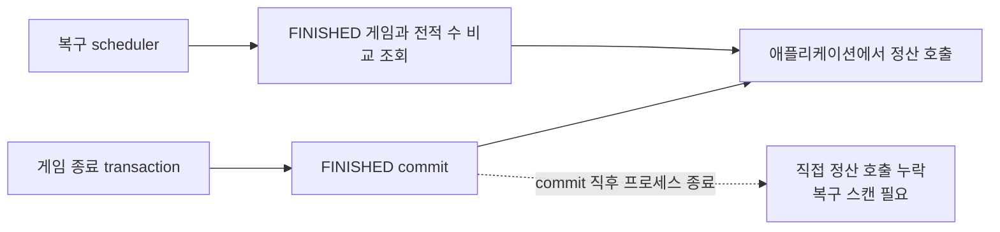
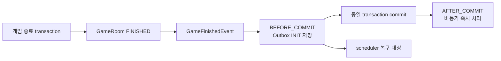
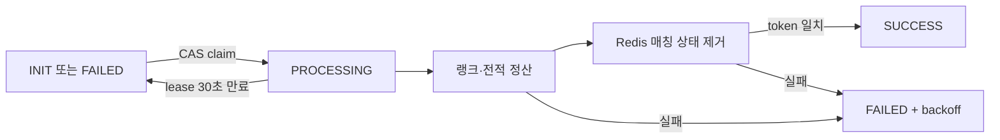

# 게임 정산 Transactional Outbox 적용

## 문제

게임 종료와 랭크·전적 정산은 서로 다른 트랜잭션으로 처리된다. 게임 종료 트랜잭션이 커밋된 뒤 애플리케이션에서 정산을 직접 호출하면, 커밋 직후 프로세스가 종료되는 구간에서 게임은 `FINISHED`지만 정산 작업은 전달되지 않을 수 있다.

기존 복구 스케줄러는 `FINISHED` 게임과 전적 개수를 주기적으로 비교해 미정산 게임을 다시 찾았다. 복구는 가능하지만 게임 데이터가 증가할수록 완료된 게임까지 반복해서 검색해야 하며, 정산해야 할 작업 자체의 상태와 재시도 횟수도 관리할 수 없었다.

## 개선 전

| 항목 | 기존 직접 호출·게임 테이블 스캔 |
| --- | --- |
| 게임 종료와 정산 작업 기록 | 원자성 없음 |
| 프로세스 종료 시 복구 | `FINISHED` 게임 재검색 |
| 작업 상태 | 별도 상태 없음 |
| 실패 횟수·다음 재시도 시각 | 관리하지 않음 |
| 다중 인스턴스 작업 소유권 | 게임 row lock에 의존 |

## 해결

### 게임 종료와 Outbox 저장을 하나의 트랜잭션으로 처리

게임 상태가 `FINISHED`로 전환될 때 `GameFinishedEvent`를 발행한다. `BEFORE_COMMIT` listener가 `game_settlement_outbox`에 작업을 저장하므로 게임 종료와 정산 작업 기록은 함께 커밋되거나 함께 롤백된다.

커밋 후에는 별도 executor가 해당 event를 즉시 처리한다. 즉시 처리에 실패하거나 프로세스가 종료돼도 Outbox row가 남아 있으므로 scheduler가 다시 처리할 수 있다.

### 상태·lease·fencing token으로 재처리 제어

Outbox 상태는 `INIT`, `PROCESSING`, `SUCCESS`, `FAILED`로 관리한다. 워커는 조건부 UPDATE로 작업을 선점하고 30초 lease와 UUID lock token을 발급한다.

처리가 늦어진 기존 워커가 lease 만료 후 재선점한 워커의 결과를 덮어쓰지 못하도록, 완료와 실패 처리 시 선점할 때 받은 lock token이 일치하는지 확인한다. 실패 작업은 1초부터 최대 60초까지 지수 backoff를 적용해 다시 처리한다.

### 정산 완료 범위를 명확하게 정의

워커는 다음 순서를 모두 완료한 뒤에만 Outbox를 `SUCCESS`로 변경한다.

1. 게임 room을 비관적 lock으로 조회
2. 양쪽 사용자의 랭크와 전적 정산
3. 사용자별 `GameRecord` 2건 저장
4. Redis 매칭 사용자 상태 제거
5. Outbox `SUCCESS` 변경

게임별 전적이 이미 2건이면 정산을 종료하도록 해 재전달에도 같은 전적이 중복 생성되지 않는다.

## 검증

### 트랜잭션·동시성 테스트

Testcontainers를 최근 Docker Engine과 호환되는 `1.21.4`로 올리고 Redis 컨테이너를 포함한 전체 테스트를 실행했다.

| 검증 항목 | 결과 |
| --- | ---: |
| 전체 테스트 | 867개 |
| 실패 / 오류 / skip | 0 / 0 / 0 |
| 게임 종료와 Outbox 동시 commit | 통과 |
| 게임 종료 rollback 시 Outbox 미저장 | 통과 |
| 다중 워커 단일 선점 | 통과 |
| lease 만료 후 재선점 | 통과 |
| 기존 워커의 stale 완료·실패 차단 | 통과 |
| 실제 랭크 변경과 전적 2건 생성 | 통과 |

### Outbox 처리 구조 격리 테스트

사용자 5,000명에 해당하는 Outbox 2,500건을 생성하고, 실제 정산과 Redis 호출은 mock 처리해 Outbox 선점과 상태 전환 비용만 측정했다.

| DB | Outbox | 처리 시간 | 처리량 |
| --- | ---: | ---: | ---: |
| H2 | 2,500건 | 2.576초 | 약 970건/s |
| MySQL 8 | 2,500건 | 22.011초 | 약 113.6건/s |

이 결과는 Outbox 저장소 자체의 처리량이며 실제 랭크·전적 정산 시간은 포함하지 않는다.

### k6 실제 정산 E2E 테스트

격리된 MySQL 8, Redis, API 2개 인스턴스 환경에서 종료된 게임 2,500건과 사용자 5,000명을 준비했다. 500 VU가 각 사용자 토큰으로 게임 summary를 조회하고, `PENDING`에서 전적 생성이 끝난 `DONE` 상태로 전환될 때까지 확인했다.

정산 처리와 동시에 강한 조회 경쟁을 만들기 위해 summary를 100ms 간격으로 폴링했다. API가 응답으로 안내하는 정상 재조회 간격 1초보다 10배 빠른 스트레스 조건이다.

| 항목 | 결과 |
| --- | ---: |
| 사용자 / 게임 | 5,000명 / 2,500건 |
| API 인스턴스 / k6 VU | 2개 / 500 VU |
| summary 요청 | 751,891회 |
| 평균 요청 처리량 | 약 3,042 req/s |
| HTTP 평균 / p95 / 최대 | 60.34ms / 144.06ms / 813.11ms |
| HTTP 실패 | 58건, 약 0.0077% |
| 정산 완료 평균 / 중앙값 | 2분 5초 / 2분 8초 |
| 정산 완료 p90 / p95 / 최대 | 3분 54초 / 4분 2초 / 4분 7초 |
| 최대 완료 시간 기준 실효 정산 처리량 | 약 10.1 game/s |
| 완료 사용자 / timeout | 5,000명 / 0명 |
| Outbox SUCCESS / retry | 2,500건 / 0건 |
| 생성 전적 / 반영 사용자 | 5,000건 / 5,000명 |
| Outbox 처리 오류 로그 | 0건 |

HTTP 실패 58건은 부하 시작을 위해 pause했던 컨테이너를 재개하는 순간 발생한 연결 거절이다. 이후 두 인스턴스는 종료나 OOM 없이 동작했다.

최종 상태를 확인한 결과 Outbox 2,500건이 모두 `SUCCESS`였고, 게임별 2건씩 총 5,000건의 전적이 생성됐으며 timeout과 retry는 발생하지 않았다. 다만 임시로 설정한 `정산 완료 p95 < 4분` 기준은 2초 초과했으므로 성능 threshold는 통과하지 못했다.

## 처리 시간이 길어진 원인

### 복구 경로는 인스턴스별 순차 처리

이번 테스트는 정상적인 게임 종료 이벤트를 발생시키지 않고 `INIT` Outbox 2,500건을 한 번에 적재했다. 따라서 `AFTER_COMMIT` executor의 즉시 처리 경로가 아니라 scheduler 복구 경로만 사용했다.

배치 크기 100은 한 번에 선점하는 작업 수다. 선점한 작업은 `claimed.forEach(processor::process)`로 처리하므로 한 인스턴스 안에서는 병렬이 아니다. API 2개 기준 실질적인 복구 정산 동시성은 최대 2개였다.

### 한 게임 정산에 여러 DB 왕복과 lock이 필요

정산 한 건은 단순 UPDATE가 아니다. 게임 room lock, 기존 전적 수 확인, 참가자 조회, 사용자 랭크 2건의 비관적 lock, 진행 중인 랭크 시리즈 조회, 랭크 갱신, 전적 2건 INSERT를 수행한다. 이후 Redis 상태를 제거하고 별도 트랜잭션으로 Outbox 완료 상태를 기록한다.

현재 claim도 후보 목록 조회 후 event마다 조건부 UPDATE와 `findById`를 실행하고, 완료 처리는 `lockToken`을 조건으로 둔 UPDATE를 수행한다. 배치로 100건을 가져와도 정산 전후의 Outbox SQL은 작업별로 반복된다.

정합성을 위한 직렬화 비용이 있으므로 Outbox row의 상태만 변경한 MySQL 격리 테스트 22.011초보다 실제 E2E가 훨씬 오래 걸린다.

### 100ms summary 폴링이 정산 쿼리와 경쟁

테스트 중 751,891회의 summary 요청이 평균 약 3,042 req/s로 발생했다. `PENDING` 확인도 게임 summary와 전적 개수를 DB에서 조회하므로, 조회 트랜잭션이 정산의 lock·UPDATE·INSERT와 같은 MySQL connection pool과 CPU·I/O를 사용했다.

따라서 p95 4분 2초는 Outbox 워커만의 순수 처리 시간이 아니라, 복구 backlog 2,500건과 과도한 summary 조회가 동시에 발생한 E2E 스트레스 결과다.

## 결과와 다음 기준

- 게임 종료와 Outbox 저장을 같은 트랜잭션으로 묶고, commit과 rollback이 함께 수행되는 것을 테스트해 정산 작업 기록의 원자성을 확인했다.
- lease와 fencing token으로 다중 인스턴스의 중복 선점과 오래된 워커의 상태 덮어쓰기를 차단했다.
- 사용자 5,000명, 게임 2,500건을 실제 정산해 Outbox 2,500건과 전적 5,000건이 retry 없이 완료되는 것을 확인했다.
- 이번 테스트는 복구 경로 내구성은 검증했지만 정상 트래픽의 정산 지연을 대표하지 않는다.
- 다음 성능 비교는 API가 안내하는 1초 polling을 적용하고, 정상 `AFTER_COMMIT` 처리와 backlog 복구 처리를 분리해 측정해야 한다.
- 복구 처리량을 높일 때는 인스턴스별 제한된 병렬 워커, claim 후 개별 `findById` 제거, summary polling backoff 순서로 검토한다.
