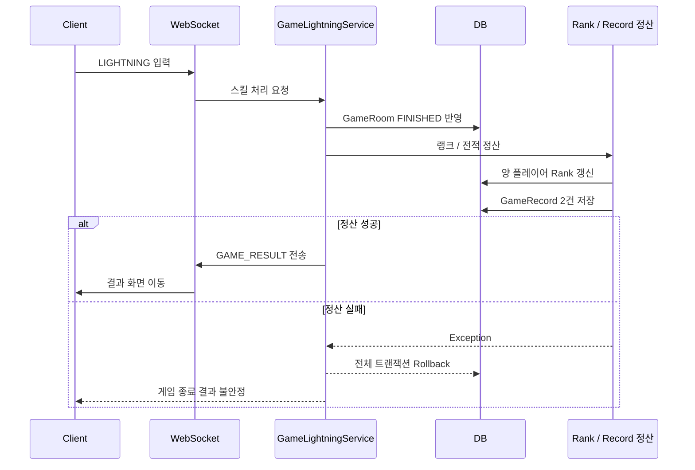
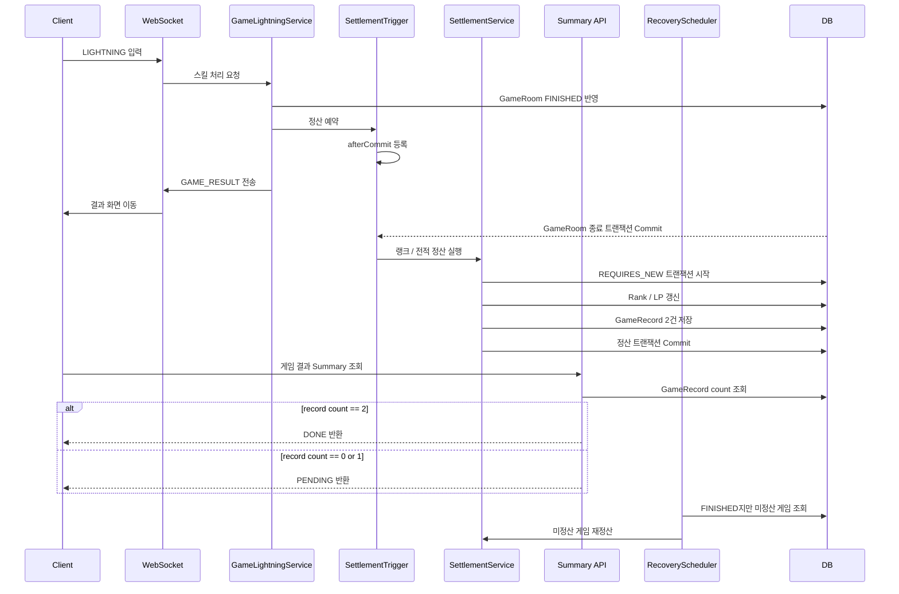
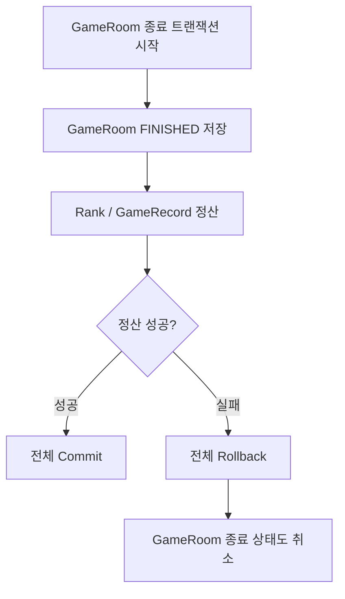
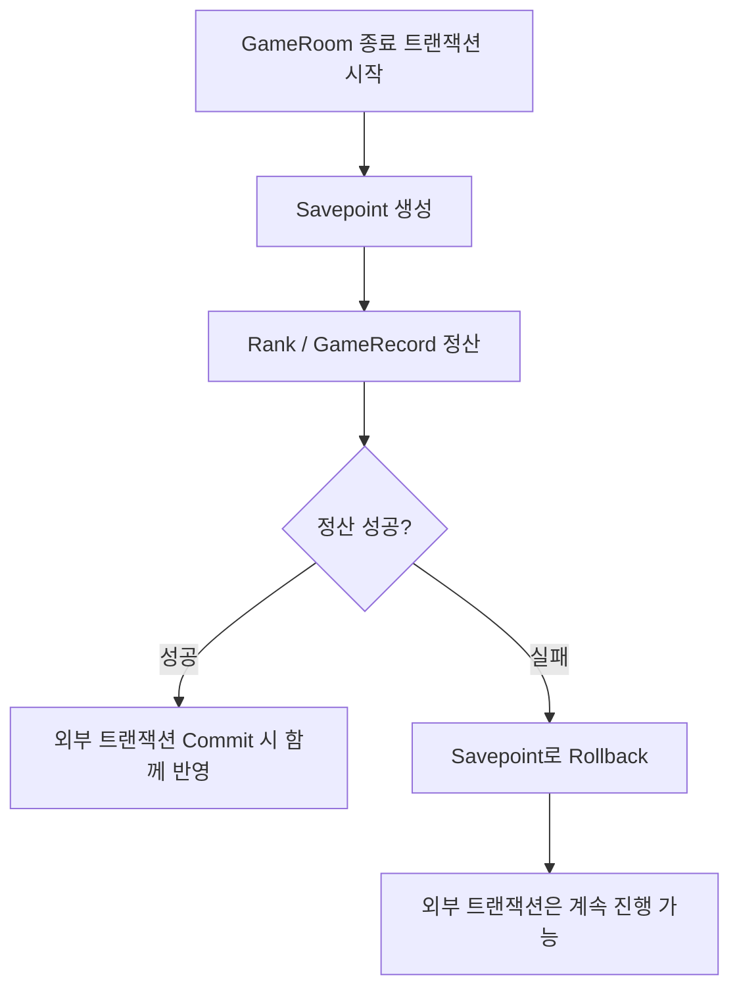
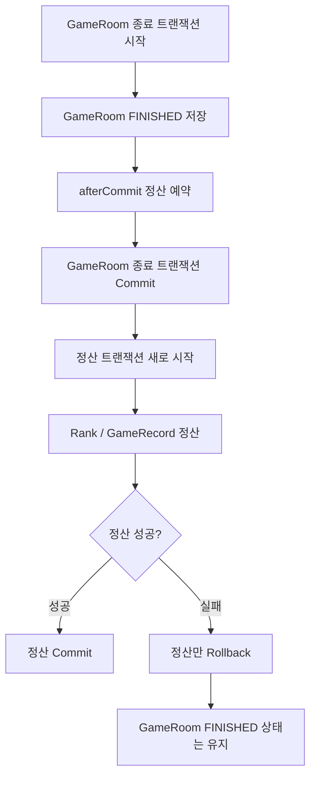

# 게임 종료와 랭크 정산 트랜잭션 분리

## 개선 전 흐름

## 개선 후 흐름

## 문제 원인

게임 종료와 정산 책임 혼재 : 게임 종료 시 결과 화면에는 `GameRoom`의 종료 상태와 양 플레이어의 정산 결과가 모두 필요했다. `GameRoom.status`, `winnerId`, `result`, `finishedAt`은 게임 종료를 확정하는 데이터이고, `GameRecord`, `lpBefore`, `lpAfter`, `rankBefore`, `rankAfter`는 종료 이후 결과 화면을 위한 정산 데이터였다. 두 작업을 하나의 트랜잭션에 묶으면 실시간 게임 종료 흐름과 후처리 성격의 정산 흐름이 강하게 결합되는 문제가 있었다.

정산 실패에 의한 종료 롤백 위험 : 랭크 정산은 양 플레이어의 Rank 조회, LP 계산, Rank 갱신, GameRecord 2건 생성을 포함한다. 이 과정에서 Rank 데이터 누락, DB 저장 실패, 예외가 발생하면 이미 승패가 결정된 `GameRoom` 종료 상태까지 함께 롤백될 수 있었다.

결과 화면 조회 타이밍 불일치 : WebSocket으로 `GAME_RESULT`를 받은 클라이언트는 즉시 결과 화면으로 이동한다. 하지만 랭크 / 전적 정산이 아직 완료되지 않았다면 결과 화면에서 필요한 `GameRecord` 2건이 존재하지 않을 수 있었다.

부분 정산 상태 처리 필요 : 정상 정산 상태는 한 게임에 대해 양 플레이어 기준 `GameRecord`가 2건 생성된 상태이다. 장애 상황에서는 record가 0건 또는 1건만 존재할 수 있으므로, 결과 조회와 복구 로직에서 이를 명확히 구분해야 했다.

중복 정산 위험 : WebSocket 종료 처리, 자연 종료 스케줄러, 복구 스케줄러 등 여러 경로에서 같은 게임의 정산이 재시도될 수 있었다. 따라서 같은 `gameRoomId`에 대해 전적이 중복 생성되지 않도록 정산 멱등성을 보장해야 했다.

## 해결 과정

게임 종료를 먼저 확정 : `GameLightningService`에서 스킬 판정 결과 HP가 0 이하가 되면 `GameRoom`을 `FINISHED` 상태로 먼저 저장했다. 이 단계에서는 승자, 결과, 종료 시각처럼 게임 종료 자체에 필요한 정보만 확정했다.

정산 실행 시점을 afterCommit으로 이동 : `GameRecordRankSettlementTrigger`에서 현재 트랜잭션이 활성화되어 있으면 `TransactionSynchronizationManager.registerSynchronization()`을 사용해 `afterCommit`에 정산 작업을 등록했다. 이를 통해 `GameRoom` 종료 트랜잭션이 실제로 commit된 이후에만 랭크 / 전적 정산이 시작되도록 했다.

정산 트랜잭션을 REQUIRES_NEW로 분리 : `GameRecordRankSettlementService.settleFinishedGameRoom()`에 `@Transactional(propagation = Propagation.REQUIRES_NEW)`를 적용했다. 정산 실패가 게임 종료 트랜잭션에 영향을 주지 않도록 트랜잭션 경계를 분리하고, 정산을 독립적인 실패 / 재시도 단위로 만들었다.

정산 상태를 record count로 판단 : 정산 서비스는 `gameRoomId` 기준 `GameRecord` 개수를 먼저 확인한다. record가 2건이면 이미 정산된 게임으로 보고 종료하고, 0건이면 정산을 수행한다. record가 1건이면 부분 정산 상태로 판단해 비정상 상태를 드러내도록 했다.

결과 Summary API에 PENDING / DONE 모델 도입 : `GameSummaryService`는 게임이 `FINISHED`여도 record count가 0건 또는 1건이면 `PENDING`을 반환한다. record가 2건일 때만 `DONE`과 함께 양 플레이어의 결과, LP 변화량, 랭크 변화를 반환한다. 클라이언트는 `PENDING` 응답의 `retryAfterMillis = 1000` 기준으로 재조회한다.

복구 스케줄러 추가 : 정산 실패가 발생해도 게임 종료 상태는 유지되므로, `GameRecordRankSettlementRecoveryScheduler`가 주기적으로 `FINISHED` 상태지만 record가 정상적으로 2건 생성되지 않은 게임을 조회한다. record가 0건이면 재정산을 시도하고, 2건이면 매칭 상태 cleanup을 수행한다.

정산 완료 이후 매칭 상태 cleanup : 게임이 끝난 뒤 Redis에 유저 상태가 `IN_GAME`으로 남으면 다음 매칭에 진입하지 못할 수 있다. 이를 방지하기 위해 record count가 2건인 정산 완료 상태에서만 match user status를 cleanup하도록 분리했다.

## 트랜잭션 전파 옵션 비교

정산 로직은 게임 종료 이후 실행되어야 하지만, 정산 실패가 게임 종료 확정을 롤백시키면 안 됐다. 따라서 단순히 `@Transactional`을 추가하는 것이 아니라 어떤 전파 옵션을 사용할지 비교했다.

### REQUIRED

`REQUIRED`는 기본 전파 옵션이므로 기존 트랜잭션이 있으면 같은 트랜잭션에 참여한다. 이 방식은 게임 종료와 정산을 하나의 원자적 작업으로 묶을 수 있다는 장점이 있다.

하지만 이 프로젝트에서는 적합하지 않았다. 게임 종료는 이미 실시간 플레이에서 승패가 결정된 상태를 확정하는 작업이고, 랭크 / 전적 정산은 결과 저장을 위한 후처리 작업이다. 정산 중 예외가 발생했을 때 `GameRoom`의 `FINISHED` 상태까지 롤백되면 클라이언트가 받은 `GAME_RESULT`와 DB 상태가 불일치할 수 있었다.

### NESTED

`NESTED`는 savepoint를 사용해 내부 작업만 롤백할 수 있다. 정산 실패 시 savepoint까지 되돌리고 외부 트랜잭션을 계속 진행할 수 있다는 점에서 처음에는 후보가 될 수 있었다.

하지만 `NESTED`는 외부 트랜잭션과 commit 시점을 공유한다. 즉, 정산은 여전히 `GameRoom` 종료 트랜잭션 내부에서 실행된다. 이 구조에서는 `GameRoom` 종료가 실제로 commit되기 전에 정산 로직이 실행될 수 있고, 정산 로직이 `FINISHED`로 확정된 게임만 대상으로 동작한다는 의도를 명확히 표현하기 어렵다.

또한 JPA 환경에서는 `NESTED`가 항상 기대한 방식으로 동작하지 않을 수 있다. savepoint 기반 동작은 트랜잭션 매니저와 DB 지원에 의존하고, JPA 영속성 컨텍스트 상태까지 완전히 독립시키는 개념은 아니다. 이 프로젝트에서 필요한 것은 savepoint가 아니라 게임 종료 commit 이후의 독립 정산이었다.

### REQUIRES_NEW

`REQUIRES_NEW`는 기존 트랜잭션과 독립된 새 트랜잭션을 시작한다. 이 프로젝트에서는 `afterCommit`과 함께 사용해 `GameRoom` 종료 트랜잭션이 성공적으로 commit된 이후에만 정산을 시작하도록 했다.

이 방식의 장점은 명확했다.

- 게임 종료 확정과 랭크 / 전적 정산의 실패 범위를 분리할 수 있다.
- 정산 실패가 `GameRoom FINISHED` 상태를 롤백하지 않는다.
- 정산 로직을 독립적인 재시도 단위로 만들 수 있다.
- Recovery Scheduler가 동일한 정산 서비스를 다시 호출해도 트랜잭션 경계가 유지된다.

단점도 있었다.

- 게임 종료와 정산 사이에 짧은 시간 동안 `FINISHED`지만 record가 없는 상태가 생긴다.
- 결과 조회 API가 이 중간 상태를 처리해야 한다.
- 정산 실패 시 자동 복구 로직이 필요하다.

이 단점은 Summary API의 `PENDING / DONE` 모델과 Recovery Scheduler로 보완했다. 결과적으로 이 프로젝트에서는 강한 단일 트랜잭션 일관성보다, 게임 종료를 먼저 확정하고 정산은 후처리로 안정적으로 수렴시키는 구조가 더 적합했다.

### 최종 선택

| 옵션 | 장점 | 문제점 | 판단 |
| --- | --- | --- | --- |
| `REQUIRED` | 종료와 정산을 하나의 원자적 작업으로 처리 | 정산 실패 시 게임 종료까지 롤백될 수 있음 | 부적합 |
| `NESTED` | 내부 정산만 savepoint rollback 가능 | 외부 트랜잭션 commit 전 실행, JPA 환경에서 독립 정산 의도 표현이 약함 | 부적합 |
| `REQUIRES_NEW` | 종료 commit 이후 독립 정산 가능, 실패 범위 분리 | 중간 상태 처리와 복구 로직 필요 | 선택 |

따라서 최종적으로 `afterCommit + REQUIRES_NEW` 조합을 선택했다. 게임 종료는 강하게 먼저 확정하고, 랭크 / 전적 정산은 별도 트랜잭션에서 처리한 뒤 `PENDING / DONE` 조회 모델과 복구 스케줄러로 eventual consistency를 보장하는 방향으로 설계했다.

## 테스트

afterCommit 등록 검증 : `GameRecordRankSettlementTriggerTest`에서 트랜잭션 동기화가 활성화된 경우 정산이 즉시 실행되지 않고 `afterCommit` 이후 실행되는지 검증했다.

REQUIRES_NEW 검증 : `GameRecordRankSettlementServiceTest`에서 `settleFinishedGameRoom` 메서드의 트랜잭션 전파 속성이 `Propagation.REQUIRES_NEW`인지 검증했다.

PENDING 응답 검증 : `GameSummaryServiceTest`에서 record count가 0건 또는 1건이면 `PENDING`, 2건이면 `DONE`을 반환하는지 검증했다.

복구 스케줄러 검증 : `GameRecordRankSettlementRecoverySchedulerTest`와 `GameRecordRankSettlementRecoveryServiceTest`에서 미정산 게임 복구 흐름이 호출되는지 검증했다.

매칭 상태 cleanup 검증 : `FinishedGameMatchStatusCleanupServiceTest`에서 게임 상태와 record count를 기준으로 cleanup 수행 여부를 검증했다.

## 결과

트랜잭션 영향 범위 분리 : 개선 전에는 게임 종료와 랭크 / 전적 정산이 하나의 실패 단위로 묶일 수 있었다. 개선 후에는 `GameRoom` 종료 트랜잭션과 `Rank / GameRecord` 정산 트랜잭션을 분리해, 정산 실패가 게임 종료 확정을 롤백하지 않도록 했다.

결과 화면 안정성 확보 : 게임이 `FINISHED`지만 정산 record가 아직 0건 또는 1건인 상태를 오류 화면으로 노출하지 않고 `PENDING`으로 모델링했다. record 2건이 준비된 시점에만 최종 결과를 `DONE`으로 반환하도록 했다.

정산 멱등성 확보 : 같은 게임에 대해 정산이 재호출되어도 record count가 2건이면 즉시 종료한다. 이를 통해 복구 스케줄러나 중복 호출 상황에서도 전적 중복 생성을 방지했다.

장애 복구 가능 구조 확보 : 정산이 실패해도 게임 종료 상태는 DB에 남아 있으며, 복구 스케줄러가 `FINISHED`이지만 정산되지 않은 게임을 다시 처리할 수 있다.

정량적으로 표현 가능한 개선 : 결과 Summary의 정상 완료 기준을 `GameRecord 2건`으로 고정했고, `0건 / 1건` 상태는 `PENDING`으로 분리했다. 결과 조회 재시도 간격은 `1000ms`로 명시해 클라이언트가 무한 즉시 재요청하지 않도록 했다.

## 포트폴리오 요약

게임 종료 시 결과 화면에는 `GameRoom` 종료 상태와 양 플레이어의 랭크 / 전적 정산 결과가 모두 필요했다. 하지만 랭크 정산은 두 유저의 LP 변경, 랭크 변경, 전적 2건 저장을 포함하는 후처리 작업이므로, 게임 종료 트랜잭션과 함께 묶을 경우 정산 실패가 게임 종료 확정까지 롤백시킬 수 있었다.

이를 해결하기 위해 `GameRoom` 종료 트랜잭션이 commit된 이후 `afterCommit`에서 정산을 실행하도록 분리하고, 정산 로직은 `REQUIRES_NEW` 트랜잭션으로 처리했다. 또한 결과 조회 API는 정산 완료 전에는 `PENDING`을 반환하고, 미정산 게임은 Recovery Scheduler가 재처리하도록 구성해 실시간 게임 종료 흐름과 랭크 / 전적 정산의 안정성을 분리했다.
